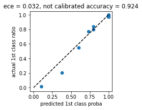

# Probability Calibration Tree with Logistic Regression in its leaves

Пример применения дерева калибровки вероятности для задачи классификации при высоком дисбалансе классов.
Посмотрим как дерево повышает точность прогноза и уменьшает ошибку калибровки вероятностей - ece (expected calibration error)

Создаём данные для задачи. Задаём дикий дисбаланс классов.
Делим данные на три части. Используя базовую модель (в данном случае это KNN) оцениваем точность и ошибку калибровки вероятностей на тестовом наборе данных.
Итак. Ошибка калибровки (ece), точность базовой модели (accuracy) и диаграмма reliability (достоверности) для базовой модели.

Далее калибруем вероятности, используя дерево. Дерево изначально переобучаем (не используем регулиризацию - глубину и т.п.) на тренировочном наборе. Определяем всевозможные пути стрижки дерева (параметр - ccp_alpha). Для каждого варианта стрижки калибруем валидационный набор в листьях логистической регрессией.
Используем все три набора данных.

Делаем контроль на данных, которые дерево не видело.
Ошибка калибровки меньше, точность прогноза выше по сравнению с базовой моделью. Здорово! Плохо лишь то, что данные пришлось делить на три части.
minimal ece = 0.015, maximum accuracy = 0.941

Но, оказывается, деревья калибровки также можно переобучить. Для этого логистическую регрессию в узлах тоже обучаем на тренировочном наборе данных.
Делаем контроль на данных, которые дерево не видело.
Результаты тоже неплохие. Т.е. данные можно делить на два набора а не на три!!!
minimal ece = 0.014, maximum accuracy = 0.946